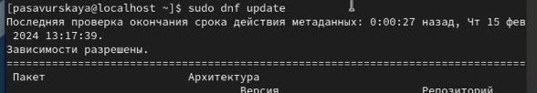

---
## Front matter
lang: ru-RU
title: Основы информационной безопасности
subtitle: лабораторная работа 1
author:
  - Савурская Полина
institute:
  - Российский университет дружбы народов, Москва, Россия
date: 16 февраля 2024

## i18n babel
babel-lang: russian
babel-otherlangs: english

## Formatting pdf
toc: false
toc-title: Содержание
slide_level: 2
aspectratio: 169
section-titles: true
theme: metropolis
header-includes:
 - \metroset{progressbar=frametitle,sectionpage=progressbar,numbering=fraction}
 - '\makeatletter'
 - '\beamer@ignorenonframefalse'
 - '\makeatother'
---

## Цель работы

Целью данной работы является приобретение практических навыков установки операционной системы на виртуальную машину, настройки минимально необходимых для дальнейшей работы сервисов.

## Задание

Установить на виртуальную машину дистрибутив Rocky и провести базовую настройку.

## Выполнение лабораторной работы

Первым делом скачиваем нужную нам версию Rocky на официальном сайте

{#fig:001 width=70%}

## Выполнение лабораторной работы

Начинаем установку на виртуальной машине, ждем окончания установки 

{#fig:002 width=70%}

## Выполнение лабораторной работы

Настраиваем Rocky на работу командами через терминал:

{#fig:003 width=70%}

{#fig:004 width=70%}

## Выполнение лабораторной работы

{#fig:005 width=70%}

{#fig:006 width=70%}

## Выводы

Мы приобрели необходимые навыки установки ОС на виртуальную машину.

