---
## Front matter
lang: ru-RU
title: Основы информационной безопасности
subtitle: лабораторная работа 2
author:
  - Савурская Полина
institute:
  - Российский университет дружбы народов, Москва, Россия
date: 16 февраля 2024

## i18n babel
babel-lang: russian
babel-otherlangs: english

## Formatting pdf
toc: false
toc-title: Содержание
slide_level: 2
aspectratio: 169
section-titles: true
theme: metropolis
header-includes:
 - \metroset{progressbar=frametitle,sectionpage=progressbar,numbering=fraction}
 - '\makeatletter'
 - '\beamer@ignorenonframefalse'
 - '\makeatother'
---

## Цель работы

Получение практических навыков работы в консоли с атрибутами файлов, закрепление теоретических основ дискреционного разграничения доступа в современных системах с открытым кодом на базе ОС Linux.

## Выполнение лабораторной работы

1. В установленной при выполнении предыдущей лабораторной работы операционной системе создайте учётную запись пользователя guest, задайте пароль для пользователя guest:

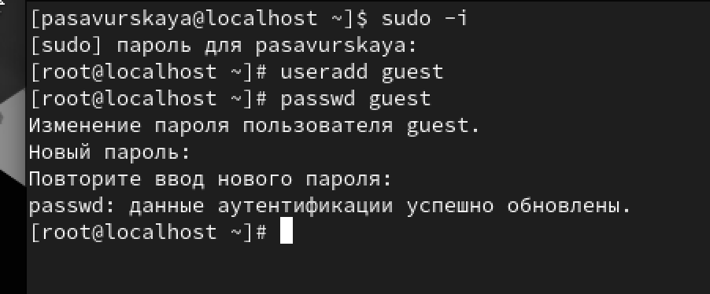{#fig:001 width=50%}

## Выполнение лабораторной работы

2. Войдите в систему от имени пользователя guest.

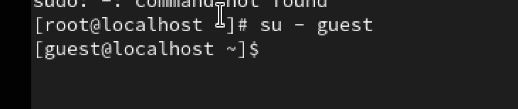{#fig:002 width=50%}

## Выполнение лабораторной работы

3. Определите директорию,в которой вы находитесь,командой pwd.Сравните её с приглашением командной строки. Она является нашей домашней директорией.

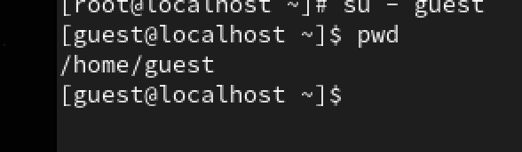{#fig:003 width=50%}

## Выполнение лабораторной работы

4. Уточните имя вашего пользователя командой whoami.

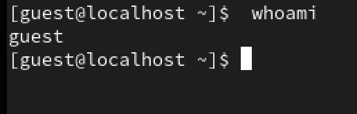{#fig:004 width=50%}

## Выполнение лабораторной работы

6. Уточните имя вашего пользователя, его группу, а также группы, куда входит пользователь, командой id. Выведенные значения uid, gid и др. запомните.

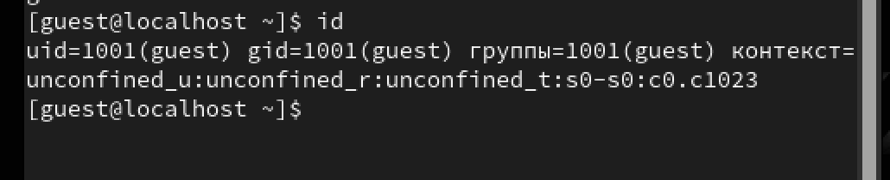{#fig:005 width=50%}

## Выполнение лабораторной работы

7. Сравните вывод id с выводом команды groups.

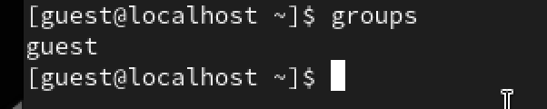{#fig:006 width=50%}

## Выполнение лабораторной работы

8. Просмотрите файл /etc/passwd командой cat /etc/passwd  | grep guest.

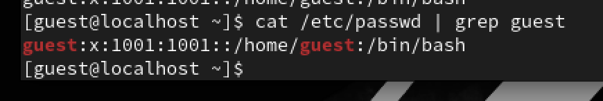{#fig:007 width=50%}

## Выполнение лабораторной работы

9. Определите существующие в системе директории командой ls -l /home/.

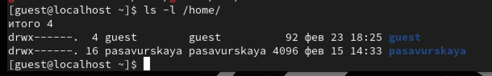{#fig:008 width=50%}

## Выполнение лабораторной работы

10. Проверьте, какие расширенные атрибуты установлены на поддиректориях, находящихся в директории /home, командой lsattr /home.

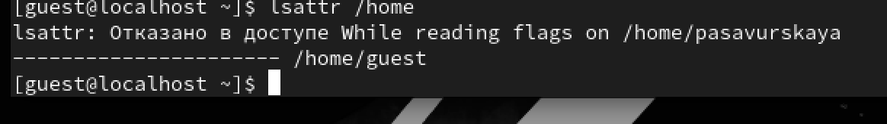{#fig:009 width=50%}

## Выполнение лабораторной работы

11. Создайте в домашней директории поддиректорию dir1 командой mkdir dir1.

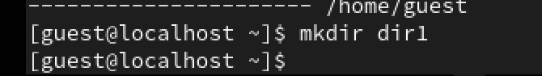{#fig:010 width=50%}

## Выполнение лабораторной работы

12. Определите командами ls -l и lsattr, какие права доступа и расширенные атрибуты были выставлены на директорию dir1.

{#fig:011 width=50%}

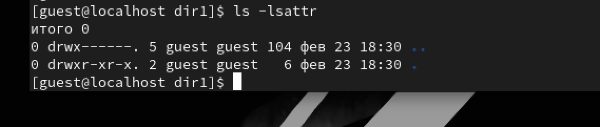{#fig:012 width=50%}

## Выполнение лабораторной работы

13. Снимите с директории dir1 все атрибуты командой chmod 000 dir1.

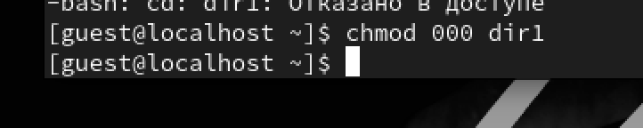{#fig:013 width=50%}

## Выполнение лабораторной работы

14. Проверьте с её помощью правильность выполнения команды ls -l.

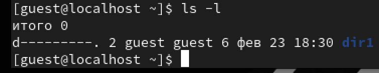{#fig:014 width=50%}

## Выполнение лабораторной работы

15. Попытайтесь создать в директории dir1 файл file1 командой echo "test" > /home/guest/dir1/file1.

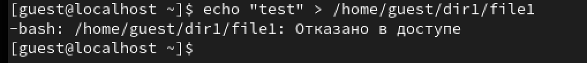{#fig:015 width=50%}

## Выполнение лабораторной работы

16. Проверьте командой ls -l /home/guest/dir1.

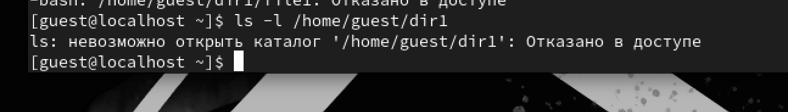{#fig:016 width=50%}

## Выполнение лабораторной работы

17. Заполните таблицу «Установленные права и разрешённые действия»

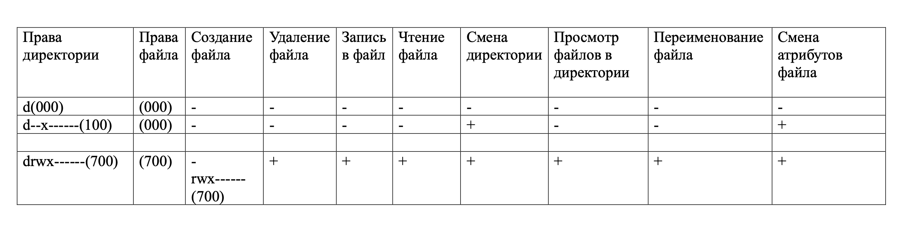{#fig:017 width=50%}

## Выводы

Мы приобрели необходимые навыки работы в консоли с атрибутами файлов.
