---
## Front matter
title: "Лабораторная работа №2"
subtitle: "Основы информационной безопасности"
author: "Савурская Полина"

## Generic otions
lang: ru-RU
toc-title: "Содержание"

## Bibliography
bibliography: bib/cite.bib
csl: pandoc/csl/gost-r-7-0-5-2008-numeric.csl

## Pdf output format
toc: true # Table of contents
toc-depth: 2
lof: true # List of figures
fontsize: 12pt
linestretch: 1.5
papersize: a4
documentclass: scrreprt
## I18n polyglossia
polyglossia-lang:
  name: russian
  options:
	- spelling=modern
	- babelshorthands=true
polyglossia-otherlangs:
  name: english
## I18n babel
babel-lang: russian
babel-otherlangs: english
## Fonts
mainfont: PT Serif
romanfont: PT Serif
sansfont: PT Sans
monofont: PT Mono
mainfontoptions: Ligatures=TeX
romanfontoptions: Ligatures=TeX
sansfontoptions: Ligatures=TeX,Scale=MatchLowercase
monofontoptions: Scale=MatchLowercase,Scale=0.9
## Biblatex
biblatex: true
biblio-style: "gost-numeric"
biblatexoptions:
  - parentracker=true
  - backend=biber
  - hyperref=auto
  - language=auto
  - autolang=other*
  - citestyle=gost-numeric
## Pandoc-crossref LaTeX customization
figureTitle: "Рис."
listingTitle: "Листинг"
lofTitle: "Список иллюстраций"
lolTitle: "Листинги"
## Misc options
indent: true
header-includes:
  - \usepackage{indentfirst}
  - \usepackage{float} # keep figures where there are in the text
  - \floatplacement{figure}{H} # keep figures where there are in the text
---

# Цель работы

Получение практических навыков работы в консоли с атрибутами файлов, закрепление теоретических основ дискреционного разграничения доступа в современных системах с открытым кодом на базе ОС Linux.

# Выполнение лабораторной работы

1. В установленной при выполнении предыдущей лабораторной работы операционной системе создайте учётную запись пользователя guest, задайте пароль для пользователя guest:

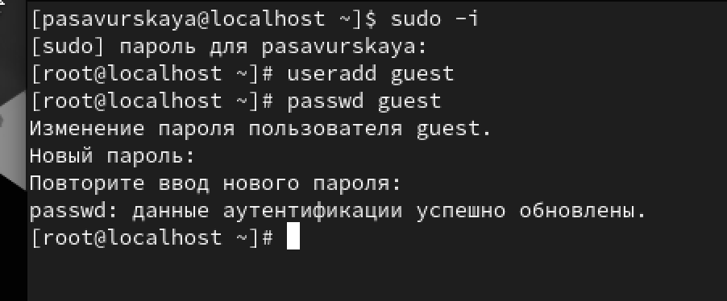{#fig:001 width=90%}

2. Войдите в систему от имени пользователя guest.

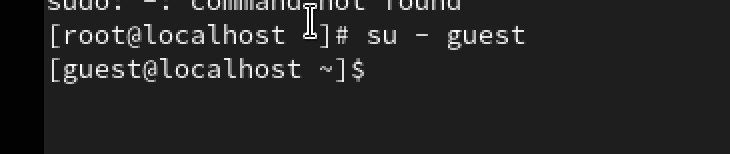{#fig:002 width=90%}

3. Определите директорию,в которой вы находитесь,командой pwd.Сравните её с приглашением командной строки. Она является нашей домашней директорией.

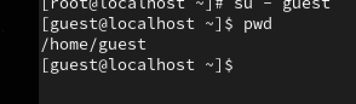{#fig:003 width=90%}

4. Уточните имя вашего пользователя командой whoami.

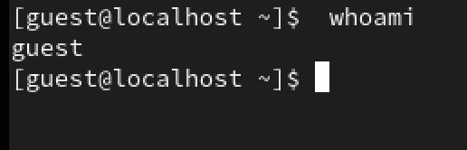{#fig:004 width=90%}

6. Уточните имя вашего пользователя, его группу, а также группы, куда входит пользователь, командой id. Выведенные значения uid, gid и др. запомните.

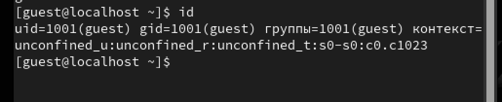{#fig:005 width=90%}

7. Сравните вывод id с выводом команды groups.

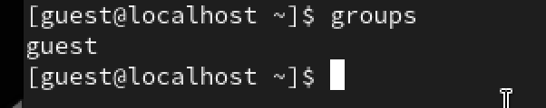{#fig:006 width=90%}

8. Просмотрите файл /etc/passwd командой cat /etc/passwd  | grep guest.

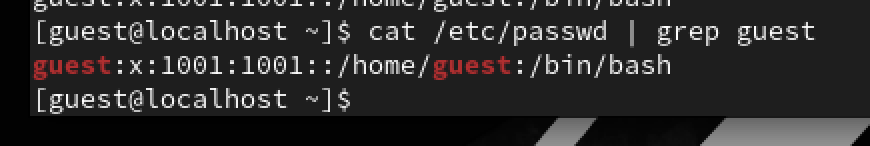{#fig:007 width=90%}

9. Определите существующие в системе директории командой ls -l /home/.

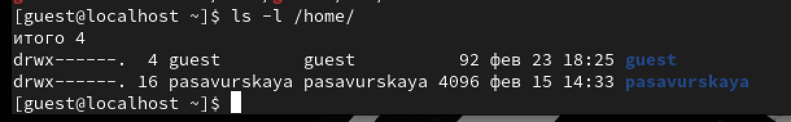{#fig:008 width=90%}

10. Проверьте, какие расширенные атрибуты установлены на поддиректориях, находящихся в директории /home, командой lsattr /home.

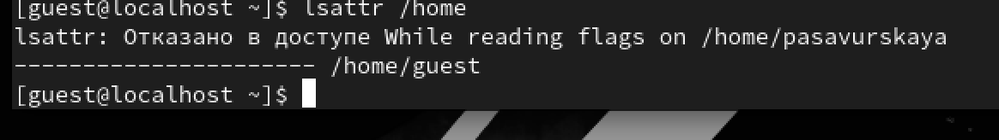{#fig:009 width=90%}

11. Создайте в домашней директории поддиректорию dir1 командой mkdir dir1.

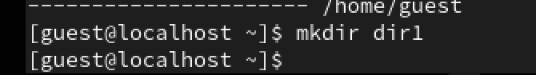{#fig:010 width=90%}

12. Определите командами ls -l и lsattr, какие права доступа и расширенные атрибуты были выставлены на директорию dir1.

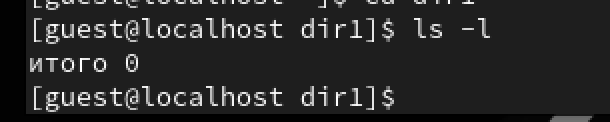{#fig:011 width=90%}

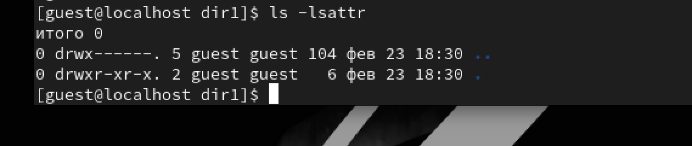{#fig:012 width=90%}

13. Снимите с директории dir1 все атрибуты командой chmod 000 dir1.

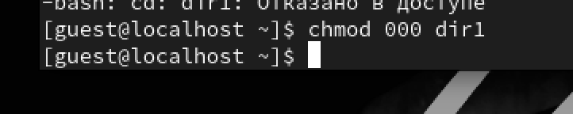{#fig:013 width=90%}

14. Проверьте с её помощью правильность выполнения команды ls -l.

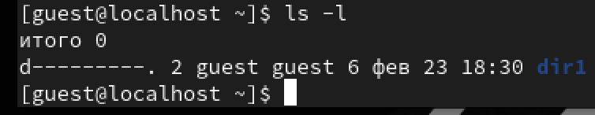{#fig:014 width=90%}

15. Попытайтесь создать в директории dir1 файл file1 командой echo "test" > /home/guest/dir1/file1.

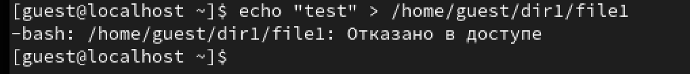{#fig:015 width=90%}

16. Проверьте командой ls -l /home/guest/dir1.

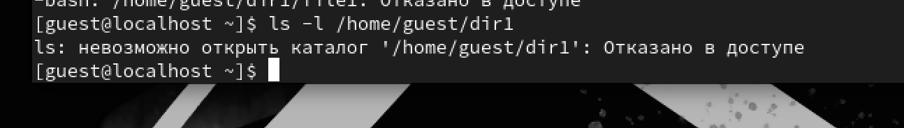{#fig:016 width=90%}

17. Заполните таблицу «Установленные права и разрешённые действия»

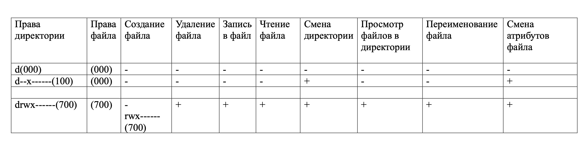{#fig:017 width=90%}

# Выводы

Мы приобрели необходимые навыки работы в консоли с атрибутами файлов.
