---
## Front matter
lang: ru-RU
title: Лабораторная работа 3
subtitle: Основы информационной безопасности
author:
  - Савурская П.С.
institute:
  - Российский университет дружбы народов, Москва, Россия
date: 16 марта 2024

## i18n babel
babel-lang: russian
babel-otherlangs: english

## Formatting pdf
toc: false
toc-title: Содержание
slide_level: 2
aspectratio: 169
section-titles: true
theme: metropolis
header-includes:
 - \metroset{progressbar=frametitle,sectionpage=progressbar,numbering=fraction}
 - '\makeatletter'
 - '\beamer@ignorenonframefalse'
 - '\makeatother'
---

## Цель работы

Получение практических навыков работы в консоли с атрибутами файлов для групп пользователей.

## Выполнение лабораторной работы

1. Создайте второго пользователя guest2 ( пользователя guest мы уже создали в ЛР 2).

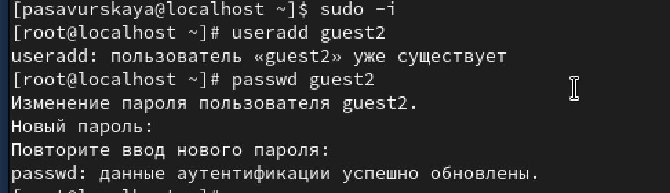{#fig:001 width=70%}

## Выполнение лабораторной работы

2. Добавьте пользователя guest2 в группу guest.

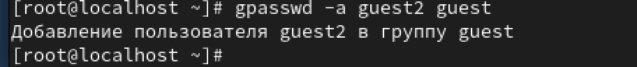{#fig:002 width=70%}

## Выполнение лабораторной работы

3. Осуществите вход в систему от двух пользователей на двух разных консолях: guest на первой консоли и guest2 на второй консоли.

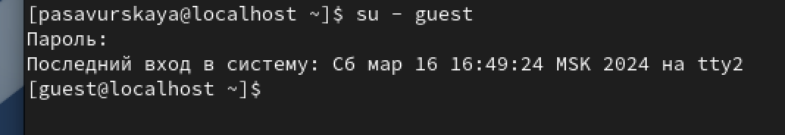{#fig:003 width=70%}

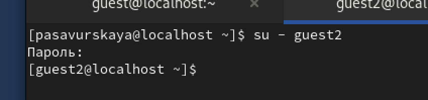{#fig:004 width=70%}

## Выполнение лабораторной работы

4. Для обоих пользователей командой pwd определите директорию, в которой вы находитесь. Сравните её с приглашениями командной строки.

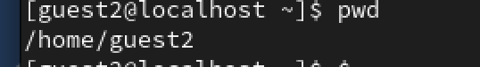{#fig:006 width=70%}

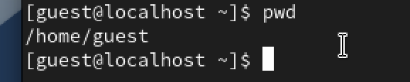{#fig:007 width=70%}

## Выполнение лабораторной работы

5. Уточните имя вашего пользователя, его группу, кто входит в неё и к каким группам принадлежит он сам. Определите командами groups guest и groups guest2, в какие группы входят пользователи guest и guest2.

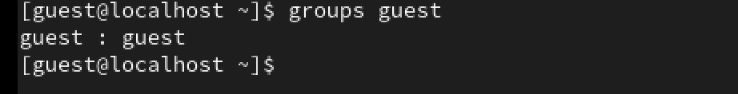{#fig:008 width=70%}

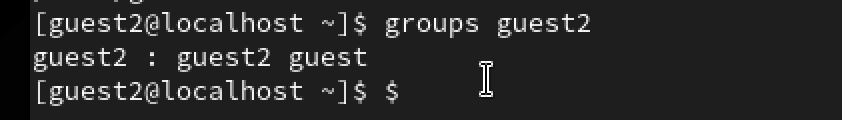{#fig:009 width=70%}

## Выполнение лабораторной работы

6. Сравните полученную информацию с содержимым файла /etc/group.

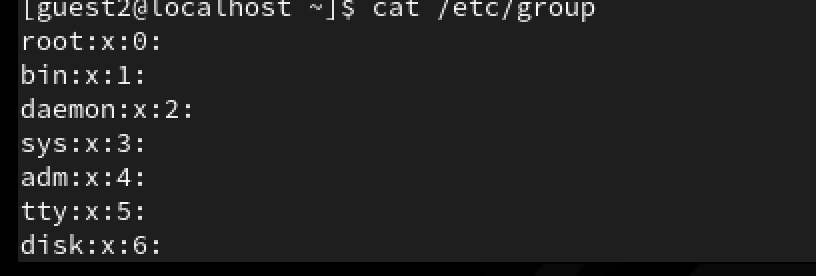{#fig:010 width=70%}

## Выполнение лабораторной работы

7. От имени пользователя guest2 выполните регистрацию пользователя guest2 в группе guest командой

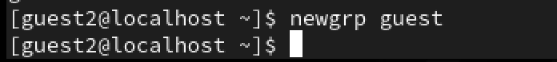{#fig:011 width=70%}

## Выполнение лабораторной работы

8. От имени пользователя guest измените права директории /home/guest, разрешив все действия для пользователей группы.

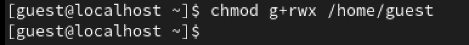{#fig:012 width=70%}

## Выполнение лабораторной работы

9. Таблица

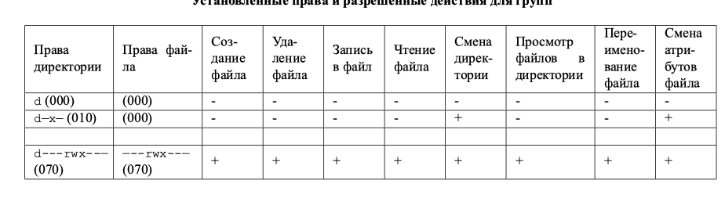{#fig:013 width=70%}

## Выводы

Мы приобрели необходимые навыки работы в консоли с атрибутами файлов для групп пользователей1.
