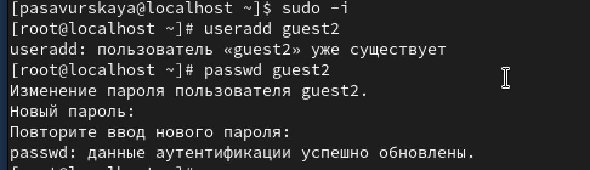
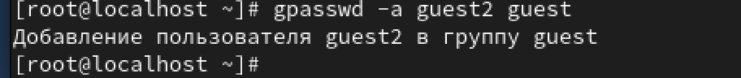
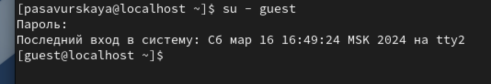
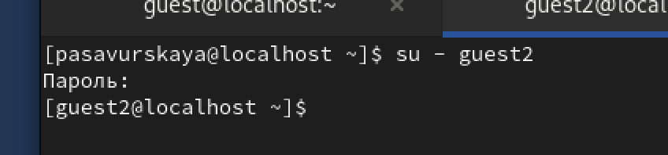
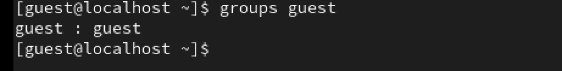
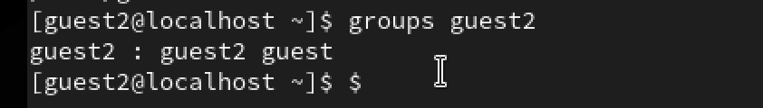
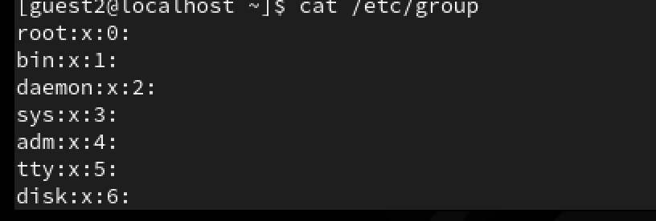
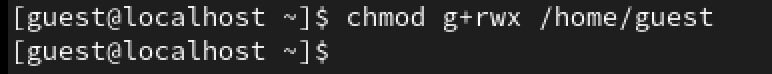
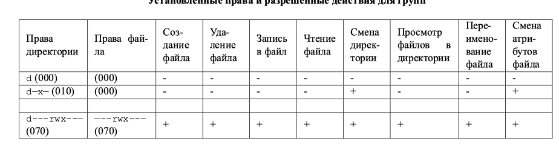

---
## Front matter
title: "Лабораторная работа №3"
subtitle: "Основы информационной безопасности"
author: "Савурская Полина"

## Generic otions
lang: ru-RU
toc-title: "Содержание"

## Bibliography
bibliography: bib/cite.bib
csl: pandoc/csl/gost-r-7-0-5-2008-numeric.csl

## Pdf output format
toc: true # Table of contents
toc-depth: 2
lof: true # List of figures
fontsize: 12pt
linestretch: 1.5
papersize: a4
documentclass: scrreprt
## I18n polyglossia
polyglossia-lang:
  name: russian
  options:
	- spelling=modern
	- babelshorthands=true
polyglossia-otherlangs:
  name: english
## I18n babel
babel-lang: russian
babel-otherlangs: english
## Fonts
mainfont: PT Serif
romanfont: PT Serif
sansfont: PT Sans
monofont: PT Mono
mainfontoptions: Ligatures=TeX
romanfontoptions: Ligatures=TeX
sansfontoptions: Ligatures=TeX,Scale=MatchLowercase
monofontoptions: Scale=MatchLowercase,Scale=0.9
## Biblatex
biblatex: true
biblio-style: "gost-numeric"
biblatexoptions:
  - parentracker=true
  - backend=biber
  - hyperref=auto
  - language=auto
  - autolang=other*
  - citestyle=gost-numeric
## Pandoc-crossref LaTeX customization
figureTitle: "Рис."
listingTitle: "Листинг"
lofTitle: "Список иллюстраций"
lolTitle: "Листинги"
## Misc options
indent: true
header-includes:
  - \usepackage{indentfirst}
  - \usepackage{float} # keep figures where there are in the text
  - \floatplacement{figure}{H} # keep figures where there are in the text
---

# Цель работы

Получение практических навыков работы в консоли с атрибутами файлов для групп пользователей.

# Выполнение лабораторной работы

1. Создайте второго пользователя guest2 ( пользователя guest мы уже создали в ЛР 2).

{#fig:001 width=90%}

2. Добавьте пользователя guest2 в группу guest.

{#fig:002 width=90%}

3. Осуществите вход в систему от двух пользователей на двух разных консолях: guest на первой консоли и guest2 на второй консоли.

{#fig:003 width=90%}

{#fig:004 width=90%}

4. Для обоих пользователей командой pwd определите директорию, в которой вы находитесь. Сравните её с приглашениями командной строки.

{#fig:006 width=90%}

{#fig:007 width=90%}

5. Уточните имя вашего пользователя, его группу, кто входит в неё и к каким группам принадлежит он сам. Определите командами groups guest и groups guest2, в какие группы входят пользователи guest и guest2.

{#fig:008 width=90%}

{#fig:009 width=90%}

6. Сравните полученную информацию с содержимым файла /etc/group.

{#fig:010 width=90%}

7. От имени пользователя guest2 выполните регистрацию пользователя guest2 в группе guest командой

{#fig:011 width=90%}

8. От имени пользователя guest измените права директории /home/guest, разрешив все действия для пользователей группы.

{#fig:012 width=90%}

9. Таблица

{#fig:013 width=90%}

# Выводы

Мы приобрели необходимые навыки работы в консоли с атрибутами файлов для групп пользователей1.
