---
## Front matter
lang: ru-RU
title: Лабораторная работа №4
subtitle: Основы информационной безопасности
author:
  - Савурская П. А.
institute:
  - Российский университет дружбы народов, Москва, Россия

## i18n babel
babel-lang: russian
babel-otherlangs: english

## Formatting pdf
toc: false
toc-title: Содержание
slide_level: 2
aspectratio: 169
section-titles: true
theme: metropolis
header-includes:
 - \metroset{progressbar=frametitle,sectionpage=progressbar,numbering=fraction}
 - '\makeatletter'
 - '\beamer@ignorenonframefalse'
 - '\makeatother'
---

# Информация

## Цель работы

Получение практических навыков работы в консоли с расширенными атрибутами файлов.

## Выполнение лабораторной работы

1. От имени пользователя guest определите расширенные атрибуты файла:

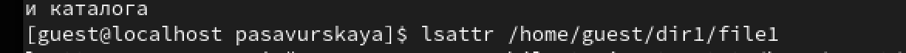{#fig:001 width=90%}

## Выполнение лабораторной работы

2. Установите командой chmod 600 file1 на файл file1 права, разрешающие чтение и запись для владельца файла.

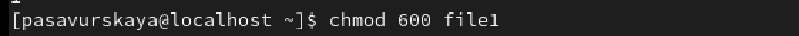{#fig:002 width=90%}

## Выполнение лабораторной работы

3. Попробуйте установить на файл /home/guest/dir1/file1 расширенный атрибут a от имени пользователя guest:

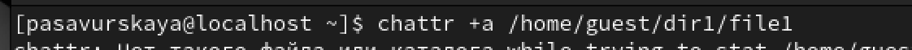{#fig:003 width=90%}

## Выполнение лабораторной работы

4. Зайдите на третью консоль с правами администратора либо повысьте свои права с помощью команды su. Попробуйте установить расширенный атрибут a на файл /home/guest/dir1/file1 от имени суперпользователя:

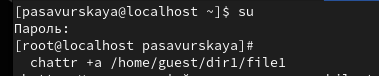{#fig:004 width=90%}

## Выполнение лабораторной работы

5. От пользователя guest проверьте правильность установления атрибута:

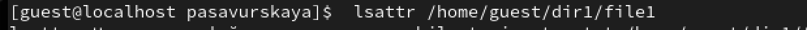{#fig:005 width=90%}

## Выполнение лабораторной работы

6. Выполните дозапись в файл file1 слова «test» командой:

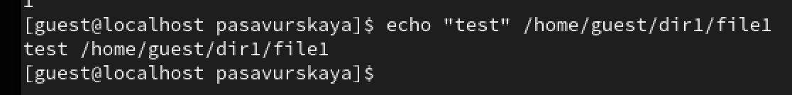{#fig:006 width=90%}

## Выполнение лабораторной работы

7. После этого выполните чтение файла file1 командой:

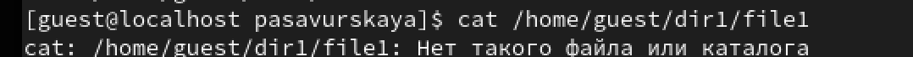{#fig:007 width=90%}

## Выполнение лабораторной работы

8. Попробуйте удалить файл file1 либо стереть имеющуюся в нём информацию командой:

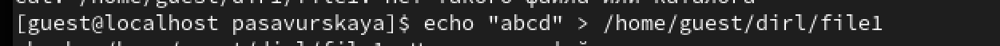{#fig:008 width=90%}

## Выполнение лабораторной работы

9. Попробуйте установить на файл file1 права, например, запрещающие чтение и запись для владельца файла.

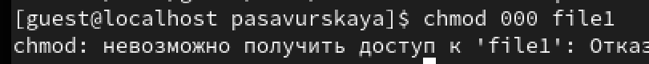{#fig:009 width=90%}

## Выполнение лабораторной работы

10. Снимите расширенный атрибут с файла /home/guest/dirl/file1 от имени суперпользователя командой

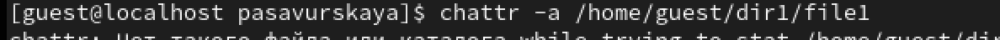{#fig:010 width=90%}

## Выполнение лабораторной работы

11. Повторите ваши действия по шагам, заменив атрибут «a» атрибутом «i».

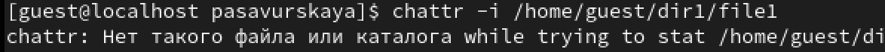{#fig:011 width=90%}

## Выводы

Мы приобрели необходимые навыки работы в консоли с расширенными атрибутами файлов.

