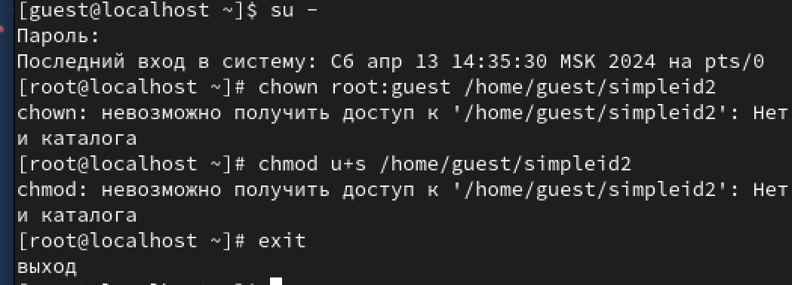

---
## Front matter
lang: ru-RU
title: Лабораторная работа 5
subtitle: Дискреционное разграничение прав в Linux. Исследование влияния дополнительных атрибутов
author:
  - Савурская П. А.
institute:
  - Российский университет дружбы народов, Москва, Россия
date: 13 апреля 2024

## i18n babel
babel-lang: russian
babel-otherlangs: english

## Formatting pdf
toc: false
toc-title: Содержание
slide_level: 2
aspectratio: 169
section-titles: true
theme: metropolis
header-includes:
 - \metroset{progressbar=frametitle,sectionpage=progressbar,numbering=fraction}
 - '\makeatletter'
 - '\beamer@ignorenonframefalse'
 - '\makeatother'
---

# Информация

## Цели и задачи

* Цель:
Изучение механизмов изменения идентификаторов, применения SetUID- и Sticky-битов. Получение практических навыков работы в консоли с дополнительными атрибутами. Рассмотрение работы механизма смены идентификатора процессов пользователей, а также влияние бита Sticky на запись и удаление файлов.

* Задачи:
  * Изучить механизмы изменения идентификаторов, применения SetUID- и Sticky-битов.
  * Получить практические навыки работы в консоли с дополнительными атрибутами.
  * Рассмотреть работы механизма смены идентификатора процессов пользователей, а также влияние бита Sticky на запись и удаление файлов.

# Выполнение лабораторной работы

## Создание программы

1) Войдем в систему от имени пользователя guest.

## Создание программы

2) Создадим программу simpleid.c.

{width=40%}

{width=40%}

## Создание программы

3) Скомпилируем программу.

## Создание программы

4) Выполним команду ./simpleid. После выполним команду id и сравним их.

## Создание программы

5) Создадим программу simpleid2.c.

{width=40%}

{width=40%}

## Создание программы

6) Скомпилируем программу.

## Создание программы

7) Запустим программу.

## Создание программы

8) От имени суперпользователя выполним следующие команды.

## Создание программы

9) Выполним проверку правильности установки новых атрибутов.

## Создание программы

10) Запустим simpleid2 и id, сравним результаты.

## Создание программы

11) Создадим программу readfile.c.

{width=40%}

{width=30%}

## Создание программы

12) Откомпилируем её.

## Создание программы

13) Выполним команду.

{width=40%}

## Исследование Sticky-бита

1) Выясним, установлен ли атрибут Sticky на директории /tmp.

## Исследование Sticky-бита

2) От имени пользователя guest создадим файл file01.txt в директории /tmp со словом test.

## Исследование Sticky-бита

3) Просмотрим атрибуты у только что созданного файла и разрешим чтение и запись для категории пользователей «все остальные».

## Исследование Sticky-бита

4) От пользователя guest2 попробуем прочитать файл.

## Исследование Sticky-бита

5) От пользователя guest2 попробуем дозаписать в файл слово test2.
Операцию выполнить не удалось.

## Исследование Sticky-бита

6) От пользователя guest2 попробуем удалить файл.
Операцию выполнить не удалось.

## Исследование Sticky-бита

7) Повысим свои права до суперпользователя и выполним после этого команду, снимающую атрибут t с директории /tmp.

## Исследование Sticky-бита

8) Снова попробуем дозаписать в файл слово test2.
Снова операцию выполнить не удалось.

## Исследование Sticky-бита

9) Снова попробуем удалить файл.
Теперь операцию выполнить удалось.

## Исследование Sticky-бита

10) Вернем атрибут t на директорию /tmp.

# Вывод

В результате выполнения работы я изучила механизмы изменения идентификаторов, применения SetUID- и Sticky-битов. Получила практические навыков работы в консоли с дополнительными атрибутами. Рассмотрела работы механизма смены идентификатора процессов пользователей, а также влияние бита Sticky на запись и удаление файлов.
