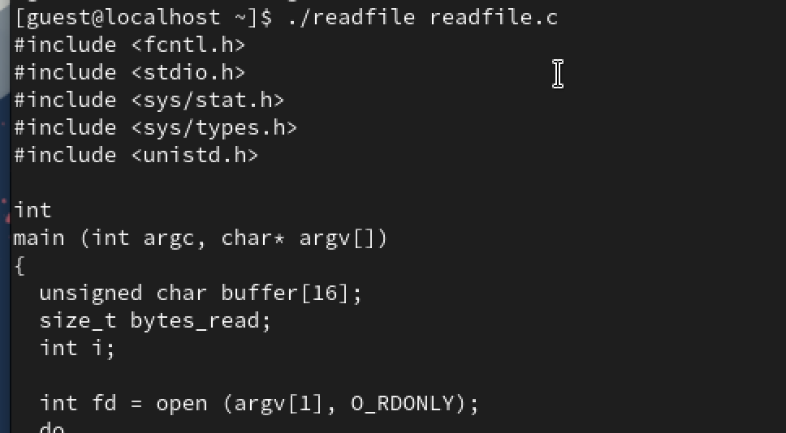
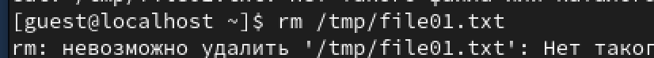

---
## Front matter
title: "Лабораторная работа №5"
subtitle: "Дискреционное разграничение прав в Linux. Исследование влияния дополнительных атрибутов"
author: "Савурская Полина"

## Generic otions
lang: ru-RU
toc-title: "Содержание"

## Bibliography
bibliography: bib/cite.bib
csl: pandoc/csl/gost-r-7-0-5-2008-numeric.csl

## Pdf output format
toc: true # Table of contents
toc-depth: 2
lof: false # List of figures
lot: false # List of tables
fontsize: 12pt
linestretch: 1.5
papersize: a4
documentclass: scrreprt
## I18n polyglossia
polyglossia-lang:
  name: russian
  options:
	- spelling=modern
	- babelshorthands=true
polyglossia-otherlangs:
  name: english
## I18n babel
babel-lang: russian
babel-otherlangs: english
## Fonts
mainfont: PT Serif
romanfont: PT Serif
sansfont: PT Sans
monofont: PT Mono
mainfontoptions: Ligatures=TeX
romanfontoptions: Ligatures=TeX
sansfontoptions: Ligatures=TeX,Scale=MatchLowercase
monofontoptions: Scale=MatchLowercase,Scale=0.9
## Biblatex
biblatex: true
biblio-style: "gost-numeric"
biblatexoptions:
  - parentracker=true
  - backend=biber
  - hyperref=auto
  - language=auto
  - autolang=other*
  - citestyle=gost-numeric
## Pandoc-crossref LaTeX customization
figureTitle: "Рис."
listingTitle: "Листинг"
lofTitle: "Список иллюстраций"
lolTitle: "Листинги"
## Misc options
indent: true
header-includes:
  - \usepackage{indentfirst}
  - \usepackage{float} # keep figures where there are in the text
  - \floatplacement{figure}{H} # keep figures where there are in the text
---

# Цель работы

Изучение механизмов изменения идентификаторов, применения SetUID- и Sticky-битов. Получение практических навыков работы в консоли с дополнительными атрибутами. Рассмотрение работы механизма смены идентификатора процессов пользователей, а также влияние бита Sticky на запись и удаление файлов.

# Задачи

- Изучить механизмы изменения идентификаторов, применения SetUID- и Sticky-битов.
- Получить практические навыки работы в консоли с дополнительными атрибутами.
- Рассмотреть работы механизма смены идентификатора процессов пользователей, а также влияние бита Sticky на запись и удаление файлов.

# Выполнение лабораторной работы

## Создание программы

1) Войдем в систему от имени пользователя guest (рис. [-@fig:001]).

{#fig:001 width=70%}

2) Создадим программу simpleid.c (рис. [-@fig:002] - [-@fig:003]).

{#fig:002 width=70%}

{#fig:003 width=70%}

3) Скомпилируем программу (рис. [-@fig:004]).

{#fig:004 width=70%}

4) Выполним команду ./simpleid. После выполним команду id и сравним их (рис. [-@fig:005]).

{#fig:005 width=70%}

5) Создадим программу simpleid2.c (рис. [-@fig:006] - [-@fig:007]).

{#fig:006 width=70%}

{#fig:007 width=70%}

6) Скомпилируем программу (рис. [-@fig:008]).

{#fig:008 width=70%}

7) Запустим программу (рис. [-@fig:009]).

{#fig:009 width=70%}

8) От имени суперпользователя выполним следующие команды (рис. [-@fig:010]).

{#fig:010 width=70%}

9) Выполним проверку правильности установки новых атрибутов (рис. [-@fig:011]).

{#fig:011 width=70%}

10) Запустим simpleid2 и id, сравним результаты (рис. [-@fig:012]).

{#fig:012 width=70%}

11) Создадим программу readfile.c (рис. [-@fig:013] - [-@fig:014]).

{#fig:013 width=70%}

{#fig:014 width=70%}

12) Откомпилируем её (рис. [-@fig:015]).

{#fig:015 width=70%}

13) Выполним команду (рис. [-@fig:016]).

{#fig:016 width=70%}

## Исследование Sticky-бита

1) Выясним, установлен ли атрибут Sticky на директории /tmp (рис. [-@fig:017]).

{#fig:017 width=70%}

2) От имени пользователя guest создадим файл file01.txt в директории /tmp со словом test (рис. [-@fig:018]).

{#fig:018 width=70%}

3) Просмотрим атрибуты у только что созданного файла и разрешим чтение и запись для категории пользователей «все остальные» (рис. [-@fig:019]).

{#fig:019 width=70%}

4) От пользователя guest2 попробуем прочитать файл (рис. [-@fig:020]).

{#fig:020 width=70%}

5) От пользователя guest2 попробуем дозаписать в файл слово test2 (рис. [-@fig:021]).
Операцию выполнить не удалось.

{#fig:021 width=70%}

6) От пользователя guest2 попробуем удалить файл (рис. [-@fig:022]).
Операцию выполнить не удалось.

{#fig:022 width=70%}

7) Повысим свои права до суперпользователя и выполним после этого команду, снимающую атрибут t с директории /tmp [-@fig:023].

{#fig:023 width=70%}

8) Снова попробуем дозаписать в файл слово test2 (рис. [-@fig:024]).
Снова операцию выполнить не удалось.

{#fig:024 width=70%}

9) Снова попробуем удалить файл (рис. [-@fig:025]).
Теперь операцию выполнить удалось.

{#fig:025 width=70%}

10) Вернем атрибут t на директорию /tmp (рис. [-@fig:026]).

{#fig:026 width=70%}

# Вывод

В результате выполнения работы я изучила механизмы изменения идентификаторов, применения SetUID- и Sticky-битов. Получила практические навыков работы в консоли с дополнительными атрибутами. Рассмотрела работы механизма смены идентификатора процессов пользователей, а также влияние бита Sticky на запись и удаление файлов.
