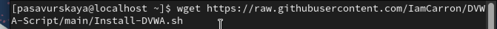
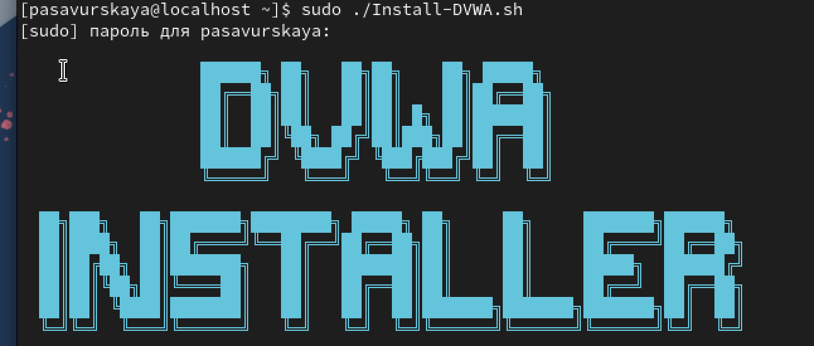

---
## Front matter
lang: ru-RU
title: 2 этап проекта
subtitle: основы информационной безопасности
author:
  - Савурская П. А.
institute:
  - Российский университет дружбы народов, Москва, Россия
date: 16 марта 2024

## i18n babel
babel-lang: russian
babel-otherlangs: english

## Formatting pdf
toc: false
toc-title: Содержание
slide_level: 2
aspectratio: 169
section-titles: true
theme: metropolis
header-includes:
 - \metroset{progressbar=frametitle,sectionpage=progressbar,numbering=fraction}
 - '\makeatletter'
 - '\beamer@ignorenonframefalse'
 - '\makeatother'
---

## Цель работы

Установите DVWA в гостевую систему к Kali Linux.

## Выполнение лабораторной работы

Переходим по ссылке на Гитхаб, оттуда берем 3 команды для установки.

{#fig:001 width=40%}

{#fig:002 width=40%}

{#fig:003 width=40%}

## Выводы

Мы установили DVWA в гостевую систему к Kali Linux.
