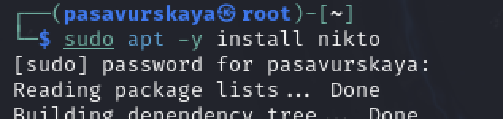
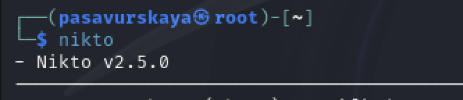

---
## Front matter
lang: ru-RU
title: 4 этап индивидуального проекта.
subtitle: Основы информационной безопасности
author:
  - Савурская П. А.
institute:
  - Российский университет дружбы народов, Москва, Россия
date: 14 апреля 2024

## i18n babel
babel-lang: russian
babel-otherlangs: english

## Formatting pdf
toc: false
toc-title: Содержание
slide_level: 2
aspectratio: 169
section-titles: true
theme: metropolis
header-includes:
 - \metroset{progressbar=frametitle,sectionpage=progressbar,numbering=fraction}
 - '\makeatletter'
 - '\beamer@ignorenonframefalse'
 - '\makeatother'
---

## Цель работы

Этап 4. Использование nikto. Установка nikto.

## Задание

nikto — базовый сканер безопасности вебсервера. Он сканирует и обнаруживает уязвимости в веб-приложениях, обычно вызванные неправильной конфигурацией на самом сервере, файлами, установленными по умолчанию, и небезопасными файлами, а также устаревшими серверными приложениями.

## Выполнение лабораторной работы

Перед установкой Nikto на ОС macOS и Windows необходимо проверить наличие Perl:

{#fig:001 width=90%}

## Выполнение лабораторной работы

Далее установим Nikto. Для установки в системах, основанных на deb (Ubuntu, Debian, Linux Mint), достаточно выполнить команду:

{#fig:002 width=90%}

## Выполнение лабораторной работы

В дистрибутивах, основанных на rpm (Red Hat Enterprise Linux, CentOS/Fedora, Mandriva Linux), необходимо выполнить команду:

{#fig:003 width=90%}

## Выполнение лабораторной работы

Для проверки корректной установки в терминале введем:

{#fig:004 width=90%}

## Выводы

Мы установили nikto.

